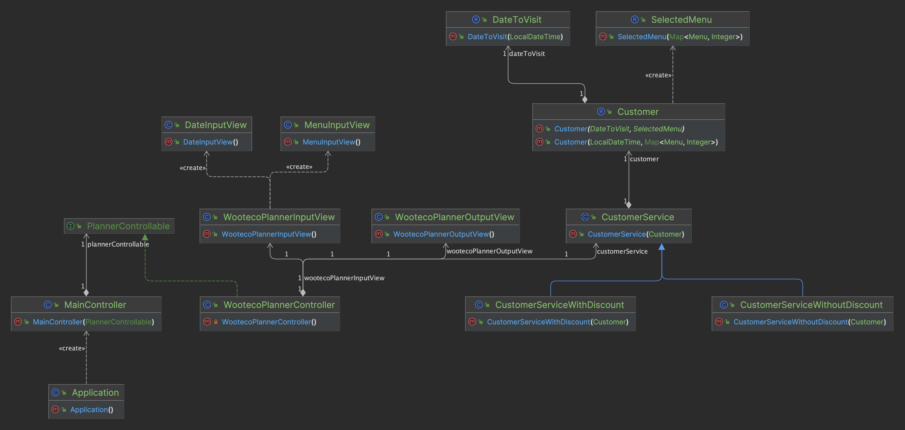

# 우아한테크코스 프리코스 4주차

# 미션 - 크리스마스 프로모션

---

## 기능 구현 특징

- [X] 날짜와 관련된 값을, 정수값이 아닌 LocalDateTime으로 사용하여 확장성을 고려하였습니다.
    - 이벤트가 23년 12월이 아닌 다른 기간에 열린다고 해도, constants.time 패키지의 EventTime 상수만 수정하면 쉽게 변화가 가능합니다.
    - LocalDateTime을 사용하기에, 연도는 2023, 월은 12월, 시간은 17시 0분 0초를 기준으로 지정하였습니다.

- [X] 가장 기본이 되는 컨트롤러를 MainController, 플래너의 기능을 담당하는 컨트롤러는 PlannerControllerable로 추상화 한 뒤 구현하였습니다.

- [X] 컨트롤러는 도메인에 직접 접근하지 않고, View에서 얻어낸 입력값을 바탕으로 CustomerService 객체를 만들고 이용합니다.
    - CustomerService는 구매 금액이 1만원 이상인 경우(이벤트 참여 가능)와 아닌 경우로 구성되어 있습니다.

- [X] 각각의 할인 방법은, DiscountStrategy라는 추상화 인터페이스를 구현하였습니다.
    - 각 구현 클래스는, 조건에 맞는 할인 금액을 반환하며, 할인 조건에 해당되지 않으면 0원을 반환합니다.
    - Discount enum에 모든 구현 클래스의 싱글턴 객체를 저장하고, 모든 할인 리스트를 불러올 수 있도록 하였습니다.

- [X] 마지막 미션인 만큼, 가능한 많은 경우를 테스트하려고 했습니다. 그러다 보니 테스트 케이스가 203개로 많이 많습니다..

## 클래스 다이어그램(상수, util 패키지는 제외)

--- 

## 기능 요구 사항

- [X] 달력 정보는, 2023년 12월 달력을 기준으로 한다.

- [X] 메뉴의 구성

      <애피타이저>
      양송이수프(6,000), 타파스(5,500), 시저샐러드(8,000)
    
      <메인>
      티본스테이크(55,000), 바비큐립(54,000), 해산물파스타(35,000), 크리스마스파스타(25,000)
    
      <디저트>
      초코케이크(15,000), 아이스크림(5,000)
    
      <음료>
      제로콜라(3,000), 레드와인(60,000), 샴페인(25,000)

- [X] 할인 이벤트의 구성

      <크리스마스 디데이 할인>
        - 12월 1일부터 12월 25일까지
        - 12월 1일 1000원 부터 시작하여, 25일까지 매일 할인 금액이 100원씩 증가
        - '총 주문' 금액에서 해당 금액만큼 할인
    
      <평일 할인>
        - 12월 1일부터 12월 31일까지
        - 일요일부터 목요일 까지
        - '디저트' 메뉴 1개당 2,023원씩 할인
    
      <주말 할인>
        - 12월 1일부터 12월 31일까지
        - 금요일, 토요일
        - '메인' 메뉴 1개당 2,023원씩 할인한다.
    
      <특별 할인>
        - 12월 1일부터 12월 31일까지
        - 이벤트 달력에 별이 있는 날(3, 10, 17, 24, 25, 31일)
        - 총 주문 금액에서 1,000원을 할인한다.
    
      <샴페인 증정>
        - 12월 1일부터 12월 31일까지
        - '할인 전' 총 주문 금액이 12만원 이상일 때, 샴페인 1개를 증정한다.
        - 샴페인 증정은, 25,000원 할인으로 작성한다.

- [X] 이벤트 배지 부여

      '총 혜택' 금액에 따라 이벤트 배지를 부여한다.
        - 5천원 이상 : 별 뱃지
        - 1만원 이상 : 트리 뱃지
        - 2만원 이상 : 산타 뱃지

- [X] 이벤트 주의 사항

      1.총 주문 금액 10,000원 이상부터 이벤트가 적용된다.
      2.음료만 주문할 수 없다.
      3.메뉴는 한 번에 최대 20개까지만 주문할 수 있다.

- [X] 진행 방법

1. 고객들이 식당에 방문할 날짜를 선택한다.

        - 1 이상 31 이하의 숫자로 입력받아야 한다.
          - 위 조건에 해당되지 않는 경우, "[ERROR] 유효하지 않은 날짜입니다. 다시 입력해주세요" 를 출력하고 다시 입력받는다.

2. 주문할 메뉴와 각 개수를 입력받는다.

        - 입력 예시 : "해산물파스타-2,레드와인-1,초코케이스-1"
        - 예외 메시지는 "[ERROR] 유효하지 않은 주문입니다. 다시 입력해주세요"로 동일하며, 예외 조건은 다음과 같다.
          (1) 메뉴판에 없는 메뉴를 입력한 경우
          (2) 메뉴의 개수가 '1' 이상의 숫자가 아닌 경우
          (3) 메뉴 형식이 예시와 다른 경우
          (4) 중복된 메뉴를 입력한 경우

3. 주문 메뉴의 출력 순서는 자유롭게 출력하며, 아래와 같은 형식으로 출력한다.

        <주문 메뉴>
        해산물파스타 2개
        레드와인 1개
        초코케이스 1개

4. 증정 메뉴를 출력한다. 증정 메뉴가 없으면 '없음'으로 출력한다.

        - 증정 메뉴가 존재하는 경우
        <증정 메뉴>
        샴페인 2개
    
        - 증정 메뉴가 존재하지 않는 경우
        <증정 메뉴>
        없음

5. 혜택 내역을 출력한다. 고객에게 적용된 이벤트 내역만 출력하며, 출력 순서는 자유, 이벤트 적용이 없다면 '없음'으로 출력한다.

        <혜택 내역>
        크리스마스 디데이 할인: -1,200원
        평일 할인: -4,046원
        특별 할인: -1,000원
        증정 이벤트: -25,000원

6. 총 혜택 금액을 출력한다.

       <총혜택 금액>
       -31,246원

7. 할인 후 예상 결제 금액을 출력한다.

       <할인 후 예상 결제 금액>
       135,754원

8. 이벤트 배지 정보를 출력한다.

       <12월 이벤트 배지>
       산타

---

## 기능 구현 사항 - 각 패키지 별

### 기능 구현 사항 - constants 패키지

- [x] EventBadge의 각 상수는 배지의 한국어 이름과 최소 주문 금액 정보를 저장하고 있습니다.

- [x] DomainErrorMessage의 상수에는 도메인에서의 예외 메시지가 저장되어 있습니다.

- [x] MenuCategory 상수는 각 메뉴의 범주가 저장되어 있습니다.

- [x] Menu의 상수는 각 메뉴의 범주와, 가격 정보가 저장되어 있습니다.

- [x] EventTime의 상수는 시간과 관련된 값들을 저장합니다. 기준 시간은 2023년 12월 17시 0분 0초로 지정하였습니다.

- [x] constants.view 패키지엔 View에서 사용되는 상수들을 저장하였습니다.

- [x] Constants 클래스는 프로그램 상에서 공통적으로 쓰이는 상수를 저장하였습니다.

---

### 기능 구현 사항 - controller 패키지

#### "우테코 플래너 이외의 다른 플래너가 들어오면 어떻게 할까?" 라는 생각으로 컨트롤러를 세분화 하였습니다.

- [x] PlannerControllable 인터페이스는, 플래너와 관련된 컨트롤러의 추상화 인터페이스입니다.

- [x] WootecoPlannerController 클래스는 프로그램에서 쓰이는 컨트롤러이며, PlannerControllable을 구현합니다.
    - 이 프로그램의 실행 로직이 포함되어 있습니다.
    - 입력을 받고, 이를 이용하여 CustomerService 객체를 얻어낸 뒤 사용합니다.

- [x] MainController 클래스는, PlannerControllable을 이용하여 프로그램을 실행시킵니다.

---

### 기능 구현 사항 - service 패키지

- [x] CustomerService는 추상 클래스이며, Customer를 필드로 가지고 Customer와 관련된 출력은 다른 구현 클래스에서 동일하게 사용하도록 설정하였습니다.
    - 할인 정보와 배지 정보만 구현 클래스에서 다르게 정의하도록 설정하였습니다.

- [x] CustomerServiceWithDiscount 클래스는, 이벤트 참여가 가능할 때(1만원 이상 구매) 이용되며, DiscountProvider, BadgeProvider 클래스의
  static 메서드를 이용해 정보를 얻어냅니다.

- [x] CustomerServiceWithoutDiscount 클래스는 이벤트 참여가 불가능할 때 이용되며, 할인 정보는 '없음', '0원'등으로 바로 반환합니다.

- [x] CustomerServiceFinder는 입력된 LocalDateTime과 Map<Menu, Integer>를 이용하여 Customer 객체를 만들고, 이벤트 참여 여부에 따라
  다른 CustomerService 객체를 반환합니다.
    - 입력값으로 Customer 객체를 만들도록 Customer의 생성자를 오버로딩 하였습니다.

---

### 기능 구현 사항 - discount 패키지

#### 할인 금액은 조건의 포맷 상 음수를 반환하도록 설정하였습니다.

    - 0을 반환할 때엔 "0원", 아닌 경우 "-123원"과 같이 출력해야 하는데, 음수를 반환하도록 하면 포맷팅을 쉽게 할 수 있기 때문입니다.

- [x] DiscountStrategy는 각 할인 정보의 추상화 인터페이스입니다.
    - 할인의 이름과 할인액, 할인되는 금액은 각 구현 클래스에서 재정의 하도록 설정하였습니다.
    - 할인 금액을 얻어낼 때엔, Customer 객체를 이용하여 얻어냅니다.

- [x] ChristmasDiscount는 크리스마스 디데이 할인 정보를 제공하며, 조건에 맞지 않는 경우 할인 금액을 0원으로 반환합니다.

- [x] SpecialDiscount는 특별 할인 정보를 제공하며, 조건에 맞지 않는 경우 할인 금액을 0원으로 반환합니다.

- [x] WeekdayDiscount는 평일 할인 정보를 제공하며, 조건에 맞지 않는 경우 할인 금액을 0원으로 반환합니다.

- [x] WeekendDiscount는 주말 할인 정보를 제공하며, 조건에 맞지 않는 경우 할인 금액을 0원으로 반환합니다.

- [x] ChampagneDiscount는 샴페인 증정 여부를 제공하며, 조건에 맞지 않는 경우 할인 금액을 0원으로 반환합니다.

- [x] Discount enum은 위의 모든 할인 정보를 저장하며, loadAllDiscounts를 통해 모든 할인 리스트를 반환합니다.
    - 할인 정보가 추가되거나 삭제되면, 상수에 정의된 값만 수정하면 되도록 설정하였습니다.

---

### 기능 구현 사항 - domain 패키지

- [x] BadgeProvider 클래스는 static 메서드인 getBadgeName을 통해 입력 금액을 검증하고, 배지 이름 정보를 반환합니다.
    - 할인 후 금액이 음수인지에 대한 예외 검증을 진행합니다. 할인 후 금액이 할인 전 금액보다 클 수 없기 때문입니다.

- [x] DiscountProvider 클래스는, Discount enum으로부터 모든 할인 리스트를 받고, 고객에 맞는 할인만을 분류합니다.
    - 분류한 할인 리스트를 받아, 할인 금액, 혜택 금액, 할인 내역을 구합니다.

- [x] SelectedMenu 클래스는 각 메뉴와 갯수의 정보를 저장한 Map<Menu, Integer>를 필드로 가지며, 이와 관련된 기능을 제공합니다.
    - 주문한 메뉴를 "타파스 1개"와 같이 반환하는 기능은 toString()을 재정의 하였습니다.
    - 메뉴가 중복되었는지, 메뉴의 총 개수가 20개를 초과하는지에 대한 예외 검증을 진행합니다.

- [x] DateToVisit 클래스는 날짜와 관련된 기능을 수행하며, 연,월에 대한 예외 검증을 생성자에서 진행합니다.

- [x] Customer 클래스는, DateToVisit과 SelectedMenu를 이용하여 고객 정보를 얻어냅니다.

---

### 기능 구현 사항 - util 패키지

- [x] PriceFormatter 클래스는 입력된 금액을 "123,456원"과 같은 형태로 변환화여 반환합니다.

---

### 기능 구현 사항 - view 패키지

- [x] DateInputView에서는, 날짜를 입력받고 예외 검증을 한 뒤, LocalDateTime 객체로 반환합니다.

- [x] MenuInputView에서는 메뉴와 개수를 입력받고 예외 검증을 한 뒤, 이를 Map<Menu, Integer>로 반환합니다.

- [x] WootecoPlannerInputView는, 위의 두 InputView를 이용하여 예외 발생시 입력을 반복하여 받도록 설정하였습니다.

- [x] WootecoPlannerOutputView는 출력과 관련된 역할을 담당합니다.

---

## 예외 검증 사항

### view에서의 예외 검증

- [x] DateInputView에서는, 입력이 모두 숫자로 이루어졌는지 검증한뒤, 숫자가 1부터 31까지의 값인지를 추가로 확인합니다.
    - 숫자 범위 검증은, 숫자가 1부터 31까지의 값이 아니면, LocalDateTime 객체를 만들 때 DateTimeException이 발생하는 것을 이용합니다.

- [x] MenuInputView에서는, 다음과 같은 예외 검증을 진행합니다.
    - (1) 입력 형식이 조건의 형태가 다른 경우를 검증합니다.
    - (2) 형식이 조건과 같다면, 입력값에서 "메뉴 이름"만 뽑아온 뒤 메뉴 존재 여부, 중복 여부, 음료만 주문한 경우에 대해 검증합니다.
    - (3) 위의 두 과정을 통과하면, 입력값에서 "메뉴 개수"만 뽑아온 뒤, 각 개수가 숫자만으로 이루어졌는지, 1 이상인지, 총합이 20이 넘는지에 대해 검증합니다.

---

### view 이외에서의 검증

#### 전체적으로, View에서의 예외 검증은 예외 메시지를 조건과 같이 통일했다면, View 이외에서의 검증은 각 상황에 맞는 예외 메시지를 출력합니다.

- [x] SelectedMenu 클래스에선, 입력된 메뉴를 Map으로 변환한 값을 이용하여, 음료만 주문했는지, 총 메뉴 개수가 20개가 넘는지에 대해 다시 검증합니다.

- [x] DateToVisit 클래스에선, 입력된 LocalDateTime이 2023년 12월인지에 대해 검증합니다.

- [x] BadgeProvider 클래스에선 입력된 할인 후의 금액이 음수인지에 대해 검증합니다.

---

## 테스트 구현 사항

### 테스트와 직접적으로 관련 없는 '일'은 25일, '시'는 17시, '분'은 0분으로 통일하였습니다.

- [x] 기본적으로 주어진 ApplicationTest : 통과

- [x] WoootecoPlannerController 클래스의 테스트
    - 날짜와, 메뉴에 대한 가능한 예외들을 발생시키며, 입력을 반복하여 받는지 확인합니다.
    - 모든 메뉴를 선택하고, 다양한 날짜를 넣으며, 정확한 할인 내역을 출력하는지 확인합니다.

- [x] DiscountStrategy의 각 구현 클래스에 대한 테스트
    - 각 할인 조건에 맞춰 조건을 만족하면 할인 금액을, 조건을 만족하지 않으면 0원을 반환하는지 확인합니다.

- [x] BadgeProvider 클래스에 대한 테스트
    - 음수인 값을 넣었을 때 예외를 발생시키는지 확인합니다.
    - 경계값을 기반으로, 알맞는 배지 이름을 반환하는지 확인합니다.

- [x] DiscountProvider 클래스에 대한 테스트
    - 모든 메뉴를 선택하고, 요일을 다르게 지정하여 정확한 할인 금액, 혜택 금액, 할인 내역을 반환하는지 확인합니다.

- [x] Customer 클래스에 대한 테스트
    - 12만원을 초과하는 경우, 12만원인 경우, 12만원 미만인 경우에 대해 샴페인 증정 여부를 정확히 반환하는지 확인합니다.
    - 1만원을 초과하는 경우, 1만원인 경우, 1만원 미만인 경우에 대해 이벤트 참여 여부를 정확히 반환하는지 확인합니다.

- [x] DateToVisit 클래스에 대한 테스트
    - 날짜가 2023년 12월이 아닐 때 예외를 발생시키는지 테스트합니다.

- [x] SelectedMenu 클래스에 대한 테스트
    - 메뉴가 20개 이상인 경우, 음료만 주문하는 경우에 대한 예외 발생을 확인합니다.
    - 모든 메뉴를 선택하고, (1)디저트 개수 (2)메인 메뉴 개수 (3)주문 메뉴 리스트를 정확히 반환하는지 확인합니다.

- [x] CustomerServiceFinder 클래스에 대한 테스트
    - 1만원 이상 주문하는 경우, 1만원 미만으로 주문하는 경우에 대해 각각 다른 CustomerService 객체를 반환하는지 확인합니다.

- [x] CustomerService 클래스에 대한 테스트
    - 구매 금액과 상관없이 공통적으로 사용되는 "주문 메뉴 출력"에 대해, 1만원 이상인 경우, 1만원 미만인 경우를 넣어 확인합니다.

- [x] CustomerServiceWithDiscount 클래스에 대한 테스트
    - 모든 메뉴를 1개씩 선택한 뒤 테스트합니다.
    - 총 혜택 금액, 할인 내역, 예상 결제 금액은 날짜를 다르게 입력하며 각각 다른 경우에 대해 확인합니다.

- [x] CustomerServiceWithoutDiscount 클래스에 대한 테스트
    - 1만원 미만이 되도록 메뉴를 지정합니다.
    - 이벤트와 관련된 출력 내용이 "없음" 또는 "0원"으로 출력되는지 확인합니다.

- [x] PriceFormatter 클래스에 대한 테스트
    - 1원부터 10억까지 모든 단위를 정해진 형식대로 정확하게 변환하는지 확인합니다.

---

## 예시 - 예외 발생시의 출력

    안녕하세요! 우테코 식당 12월 이벤트 플래너입니다.
    12월 중 식당 예상 방문 날짜는 언제인가요? (숫자만 입력해 주세요!)
    
    [ERROR] 유효하지 않은 날짜입니다. 다시 입력해 주세요.
    
    12월 중 식당 예상 방문 날짜는 언제인가요? (숫자만 입력해 주세요!)
    a
    [ERROR] 유효하지 않은 날짜입니다. 다시 입력해 주세요.
    
    12월 중 식당 예상 방문 날짜는 언제인가요? (숫자만 입력해 주세요!)
    -1
    [ERROR] 유효하지 않은 날짜입니다. 다시 입력해 주세요.
    
    12월 중 식당 예상 방문 날짜는 언제인가요? (숫자만 입력해 주세요!)
    0
    [ERROR] 유효하지 않은 날짜입니다. 다시 입력해 주세요.
    
    12월 중 식당 예상 방문 날짜는 언제인가요? (숫자만 입력해 주세요!)
    32
    [ERROR] 유효하지 않은 날짜입니다. 다시 입력해 주세요.
    
    12월 중 식당 예상 방문 날짜는 언제인가요? (숫자만 입력해 주세요!)
    25
    주문하실 메뉴를 메뉴와 개수를 알려 주세요. (e.g. 해산물파스타-2,레드와인-1,초코케이크-1)
    
    [ERROR] 유효하지 않은 주문입니다. 다시 입력해 주세요.
    
    주문하실 메뉴를 메뉴와 개수를 알려 주세요. (e.g. 해산물파스타-2,레드와인-1,초코케이크-1)
    김치찌개-1,시저샐러드-1,타파스-1
    [ERROR] 유효하지 않은 주문입니다. 다시 입력해 주세요.
    
    주문하실 메뉴를 메뉴와 개수를 알려 주세요. (e.g. 해산물파스타-2,레드와인-1,초코케이크-1)
    양송이수프-1:레드와인-1:제로콜라-1
    [ERROR] 유효하지 않은 주문입니다. 다시 입력해 주세요.
    
    주문하실 메뉴를 메뉴와 개수를 알려 주세요. (e.g. 해산물파스타-2,레드와인-1,초코케이크-1)
    시저샐러드-a,티본스테이크-1,바비큐립-1
    [ERROR] 유효하지 않은 주문입니다. 다시 입력해 주세요.
    
    주문하실 메뉴를 메뉴와 개수를 알려 주세요. (e.g. 해산물파스타-2,레드와인-1,초코케이크-1)
    시저샐러드-0,티본스테이크-1,바비큐립-1
    [ERROR] 유효하지 않은 주문입니다. 다시 입력해 주세요.
    
    주문하실 메뉴를 메뉴와 개수를 알려 주세요. (e.g. 해산물파스타-2,레드와인-1,초코케이크-1)
    제로콜라-1,레드와인-2,샴페인-3
    [ERROR] 유효하지 않은 주문입니다. 다시 입력해 주세요.
    
    주문하실 메뉴를 메뉴와 개수를 알려 주세요. (e.g. 해산물파스타-2,레드와인-1,초코케이크-1)
    해산물파스타:1,크리스마스파스타:1,초코케이크:1
    [ERROR] 유효하지 않은 주문입니다. 다시 입력해 주세요.
    
    주문하실 메뉴를 메뉴와 개수를 알려 주세요. (e.g. 해산물파스타-2,레드와인-1,초코케이크-1)
    아이스크림-20,타파스-1
    [ERROR] 유효하지 않은 주문입니다. 다시 입력해 주세요.
    
    주문하실 메뉴를 메뉴와 개수를 알려 주세요. (e.g. 해산물파스타-2,레드와인-1,초코케이크-1)
    해산물파스타-2,레드와인-1,샴페인-1,초코케이크-1,아이스크림-1
    12월 25일에 우테코 식당에서 받을 이벤트 혜택 미리 보기!
    
    <주문 메뉴>
    해산물파스타 2개
    초코케이크 1개
    아이스크림 1개
    레드와인 1개
    샴페인 1개
    
    <할인 전 총주문 금액>
    175,000원
    
    <증정 메뉴>
    샴페인 1개
    
    <혜택 내역>
    크리스마스 디데이 할인: -3,400원
    평일 할인: -4,046원
    특별 할인: -1,000원
    증정 이벤트: -25,000원
    
    <총혜택 금액>
    -33,446원
    
    <할인 후 예상 결제 금액>
    166,554원
    
    <12월 이벤트 배지>
    산타